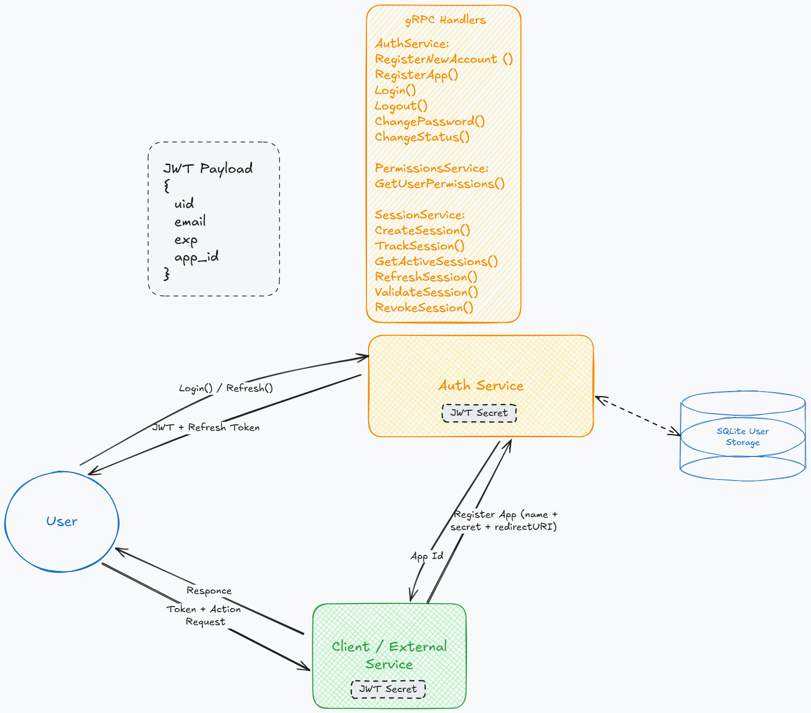
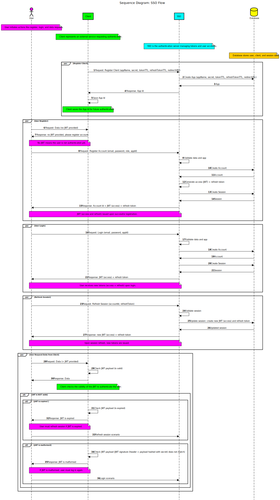

# SSO
The SSO is an **open-source microservice** for managing users and authentication across multiple apps, so that client app could **authenticate users without storing passwords locally**. 



###Key points:

- **Authorization Flow**: The client application redirects users to the SSO authentication service, where they authenticate. After successful authentication, the user is redirected back to the client with an access token (JWT) and refresh token.
- **Access Tokens & Refresh Tokens**: If the access token expires, a refresh token can be used to obtain a new access token without requiring the user to re-authenticate in SSO.
- **Passwordless Authentication**: The client application never stores user passwords. Authentication is managed by the SSO service, which securely handles user credentials.

## SSO Flow Diagram



## Getting Started

### Setup
Clone the repository:

```bash
git clone https://github.com/dariasmyr/sso.git
cd sso-microservice
```

## Configuration
Configuration files are located in `./config/`. Use `config_prod_example.yaml` as a template. 
Then you can modify `config_local.yaml` for local setups and `config_prod.yaml` for production.

### Database and Migrations
For testing, a separate database is used with migrations applied from the `./tests/migrations` directory.

## Install dependencies:

```bash
make tidy
# Or manually:
go mod tidy
```

## Build and Run
Build the service:

```bash
make build
# Or manually:
go build -o build/sso ./cmd/sso
```

Run the service (!Check the configuration file!):

```bash
make execute
# Or manually:
./build/sso --config=./config/config_local.yaml
```

## Run database migrations:

For production or default environment:
```bash
make migrations-run
# Or manually:
./build/migrator --storage-path=./storage/sso.db --migrations-path=./migrations --migrations-table=migrations
```

For testing environment:
```bash
make migrations-run MIGRATIONS_PATH=./tests/migrations STORAGE_PATH=./storage/sso-test.db
# Or manually:
./build/migrator --storage-path=./storage/sso-test.db --migrations-path=./tests/migrations --migrations-table=migrations
```

## Important Notes
- Some variables in the Makefile are hardcoded, such as `MIGRATIONS_PATH=./tests/migrations` and `STORAGE_PATH=./storage/sso-test.db`. Ensure these are adjusted if needed.
- You can run many commands either through `make` or manually, depending on your workflow.

## Test the service:
```bash
make test
# Or manually:
go test -v ./tests -count=1
```

## Docker
Build and run with Docker Compose:
```bash
# Launch
$ docker-compose up -d

# Rebuild and launch
$ docker-compose up -d --build

# Stop
Stop the service (default port: 55055):
$ docker-compose down
```

## License
Copyright © 2025 [dasha.smyr@gmail.com](https://github.com/dariasmyr).<br />
This project is [MIT](LICENSE) licensed.


